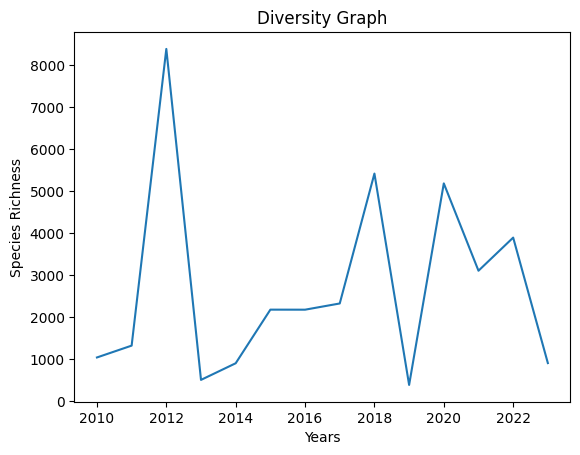
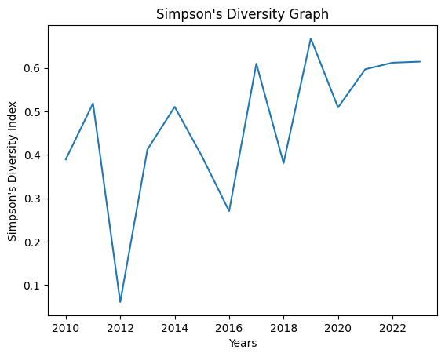

### Table: Species Diversity of Ninigrit Pond from 2010-2023

| Year | Species Richness | Simpson_diversity_index |
|------|------------------|-------------------------|
|2010| 1039             |0.3893528125643265|
|2011| 1321             |0.5184700450322066|
|2012| 8388             |0.061208187271879155|
|2013| 505              |0.41228596984410937|
|2014| 901              |0.510425251590839|
|2015| 2178             |0.3967139155818401|
|2016| 2177             |0.2704200883933857|
|2017| 2325             |0.6097052120638116|
|2018| 5419             |0.38077440353416303|
|2019| 385              |0.667845709980337|
|2020| 5185             |0.5089715513498758|
|2021| 3105             |0.5968015074622498|
|2022| 3894             |0.6119279675698841|
|2023| 905              |0.6143144764896968|

### Graph 1: Overall Species Diversity at Ninigrit Pond from 2010-2023

### Graph 2: Simpson's Diversity Index calcualted for Ninigrit Pond from 2010-2023

### Data Analysis:
a. Give one explanation for (speculate on a possible reason for) the relatively high values of D during 2011 and 2017.
* Water temperatures can have a significant effect on fish populations and fish tend to only breed when that temperature is adequate. One potential explanation for higher diversity would be adequate water temperatures during the previous mating season. This could lead to higher populations in the following year. Since the majority of fishes likely come here to mate year after year there is likely a common expectation for temperatures among the predominate species. 

b. Think about the possible reasons for the variation in species richness (S) over the years. Propose one explanation in which the main factor underlying the variation is one that operates in the natural environment of Ninigret Pond or the surrounding watershed (that is, not a factor associated with our sampling activity). Your explanation should include a short description of how this factor might influence S.
* Species richness in a protected area, like Ninigrit Pond is positively food availability. As the availability of resources fluctuate the populations fluctuate. Over population of specific species negatively relates to diversity and can be responsible for ecosystem imbalance and complete collapse of some species. In these cases you may see the overall numbers of a single species increase dramatically but the overall species richness S will decrease.   

c. From your own observations of our sampling activity, describe one way in which BIO 366 could improve the accuracy or precision of the estimates of S and D in future years, and explain how this would improve the estimates.
* We could potentially use Chao1 which is a nonparametric estimator of species richness. Choa1 assumes rare species carry information about unobserved species diversity. Chao1 can estimate population with a much more limited data set to drive analysis. This may improve our overall understanding of the true species diversity that we lack in data because our collection methods are inconsistent(i.e. done by students with little experience in the area). This would also be nice because you could potentially still use the decades worth of data that we(URI) have already collected.  
